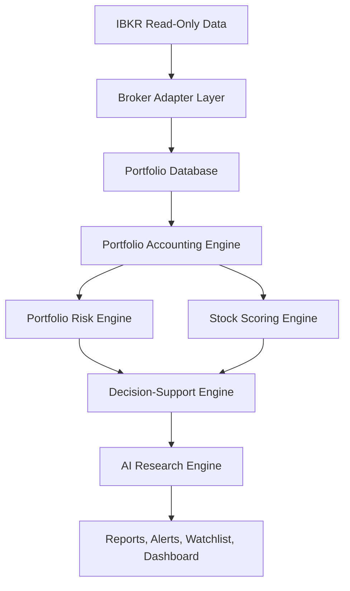

# Architecture

The default desktop/runtime uses `IBKRReadOnlyAdapter` for live Gateway/TWS read-only market and portfolio data when configured. `MockIBKRAdapter` remains available for explicit demo mode and tests. Live adapters must remain limited to the read-only `BrokerAdapter` contract (`order_generated` permanently false).

The backend is a FastAPI service with typed Pydantic schemas and SQLAlchemy models. The frontend is a Next.js dashboard consuming REST endpoints.
