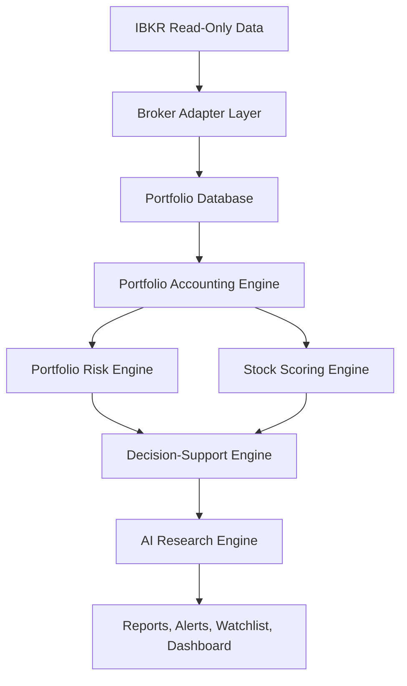

# Architecture

The default runtime uses the `IBKRReadOnlyAdapter` placeholder and returns a disconnected state until a real local read-only connector is implemented. `MockIBKRAdapter` remains available only for explicit demo mode and tests. The future live adapter must remain limited to the read-only `BrokerAdapter` contract.

The backend is a FastAPI service with typed Pydantic schemas and SQLAlchemy models. The frontend is a Next.js dashboard consuming REST endpoints.
